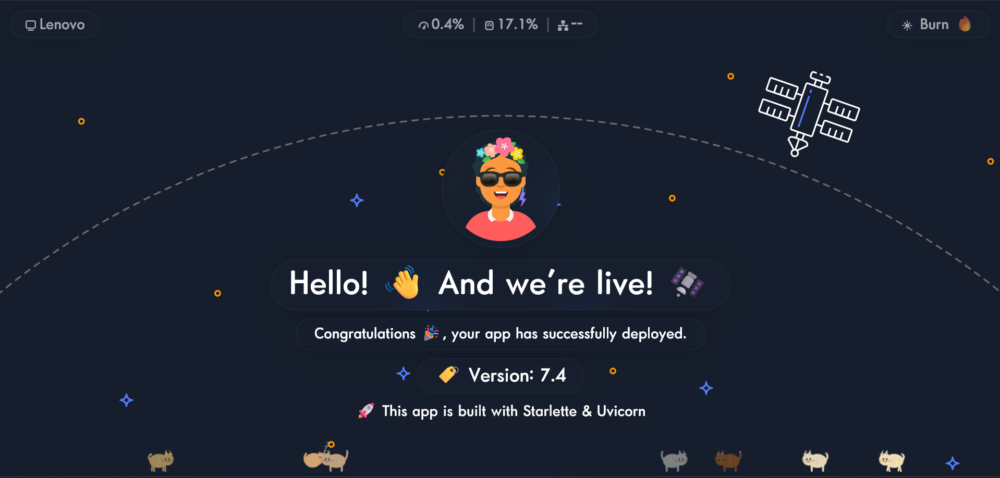

# 👋Hello App

A containerized Python web service that displays a randomly generated avatar with animated cats, stress testing tools, and Prometheus metrics.



## Quick Start

```bash
# Run locally
python app.py

# Or with Docker
docker compose up --build
```

Open http://localhost:8000

## Routes

| Route | Method | Description |
|-------|--------|-------------|
| `/` | GET | Main page with avatar, version, hostname, and message |
| `/?refresh=1` | GET | Generate a new avatar and redirect |
| `/metrics` | GET | Prometheus metrics |
| `/api/avatar` | POST | Refresh the avatar SVG |
| `/api/stress` | GET | Current stress test status |
| `/api/stress/cpu` | POST | Toggle CPU stress (spins one process per core) |
| `/api/stress/memory` | POST | Toggle RAM stress (allocates up to 60% of available memory) |
| `/api/stress/url` | POST | Toggle URL stress (50 concurrent HTTP workers) |

## Features

- **Avatar**: Randomly generated human avatar via `py_avataaars` — click to refresh
- **Cats**: Animated cats rendered on Canvas2D — click to meow and wake sleeping cats
- **Stress toggles**: CPU, RAM, and URL stress tests accessible from the burn button (top-right)
- **Hostname**: Displayed in the top-left corner
- **Version**: Read from `version.txt` — change it to update the page

## Configuration

| Variable | Default | Description |
|----------|---------|-------------|
| `PORT` | `8000` | HTTP server port |
| `LOG_LEVEL` | `INFO` | Python logging level (uppercase) and uvicorn log level (lowercase) |
| `DEBUG` | `false` | Starlette + uvicorn debug mode (`true` or `false`) |
| `FORWARDED_ALLOW_IPS` | `127.0.0.1` | Comma-separated IPs/netmasks trusted to set `X-Forwarded-*` headers when behind a reverse proxy |

Edit `version.txt` at the project root to update the version number and page message:

```
version=7.4
message=🚀 This app is built with Starlette & Uvicorn
```

## Project Structure

```
├── app.py              # Application entry point
├── Dockerfile          # Container build
├── docker-compose.yml  # Local dev setup
├── requirements.txt    # Python dependencies
├── version.txt         # Version & message config
├── templates/
│   ├── index.html      # Main page template
│   └── index.txt       # Curl/ASCII response
└── static/
    ├── background.svg  # Desktop background
    ├── background-mobile.svg
    ├── favicon.svg
    ├── meow.mp3        # Cat meow sound
    ├── preview.png     # Preview screenshot
    └── fonts/
        ├── LG_Yoyo_Bold.ttf
        └── open-sans-v18-latin-regular.*
```

